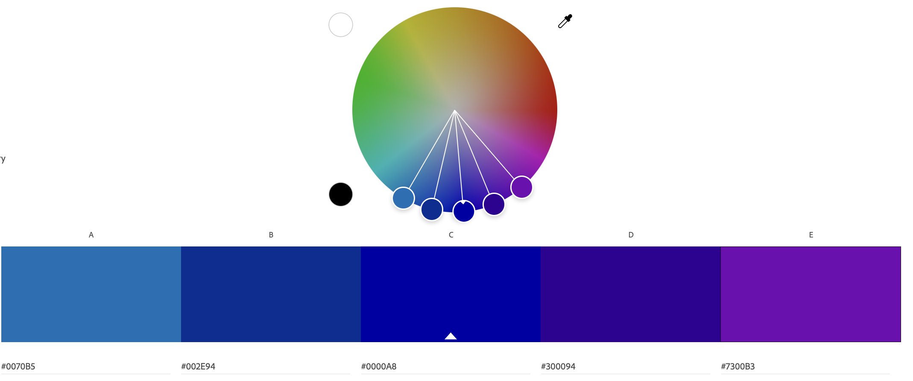

# CS4241 Assignment 1 - Ryan Kornitsky

I implemented all achievements.

## Technical

### **Style Your Page Using CSS**
- **Custom Font**: Implemented the 'Shermlock' custom font using `@font-face` and applied it to the body using `font-family: 'Shermlock', Arial, sans-serif;`.
- **Background Color**: Set the background color of the body to `#121212`.
- **Color Gradients**: Used linear gradients for styling the `
` tag and main section backgrounds.
- **Image Hover Effect**: Added a scaling transition effect to images within list items, scaling them up when hovered over.
- **Text Color Effect**: Applied a linear gradient to the main header text with a color effect using the `.color-effect` class.

### **Add a Simple JavaScript Animation to the Page**
- Implemented an RGB color effect on the main header using the `applyRgbEffect` function. This effect shifts the background position of the text to create an animated color-changing effect.

### **Experiment with Other Semantic HTML Tags**
- **Header & Navigation**: Used the `<header>` and `<nav>` tags for the main header and navigation links.
- **Main Content & Sections**: Utilized the `<main>`, `<section>`, and `<article>` tags to structure the main content, including the "About me" and "Hobbies" sections.
- **Images & List**: Incorporated `` tags within an unordered list `<ul>` to display hobbies with accompanying images.
- **Footer**: Included the `<footer>` tag to display copyright information.

## Design

### **Create a Color Palette Using color.adobe.com**
- Implemented a color palette throughout the CSS using the following colors:
  - `#0070B5`
  - `#002E94`
  - `#0000A8`
  - `#300094`
  - `#7300B3`

These colors were used in various parts of the styling, including the linear gradient for the `
` tag, the background of main sections, and the color effect on the main header. Here is the color wheel I used:

### **Use a Font from Google Fonts in Your Website**
- Used the font 'Shermlock' for all my text. This is a custom ttf.