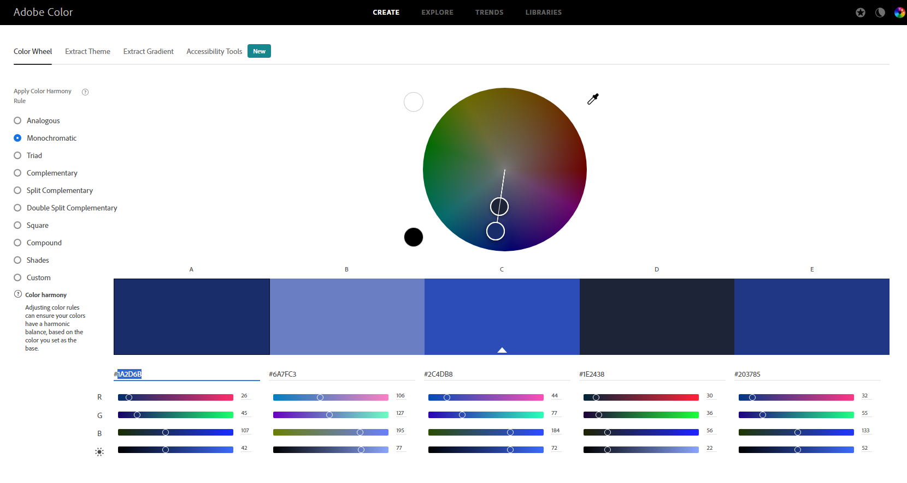

Adish Jain

## Technical Achievements
- **Styled page with CSS**:  I used a total of five rules.
1. The first rule I used was to make the body have two different colors using a gradient. 
2,3,4 Changed color and margin for the h1, h2, and the p selectors
5. For the h3 selector I created a backround for the text which changes color through an animation, happens when the page is loaded
6. I changed the margin for the li selector

- **Added JavaScript Animation**
I added a Javascript animation which moves a block at the bottom of the page from one corner of a canvas to the opposite corner. You can try it out by pressing the "Click Me for Animation" Button
I also added another animation which changes the color of the h3 from when the page is loaded from yellow to red

### Design Achievements
- **Created a color palette using color.adobe.com**

The color for the background is #1CD4CE for one half and #01FA9F for the other half. The h1 is #2AB4EB and h2 is #1C66D4 and p being #0017F5
